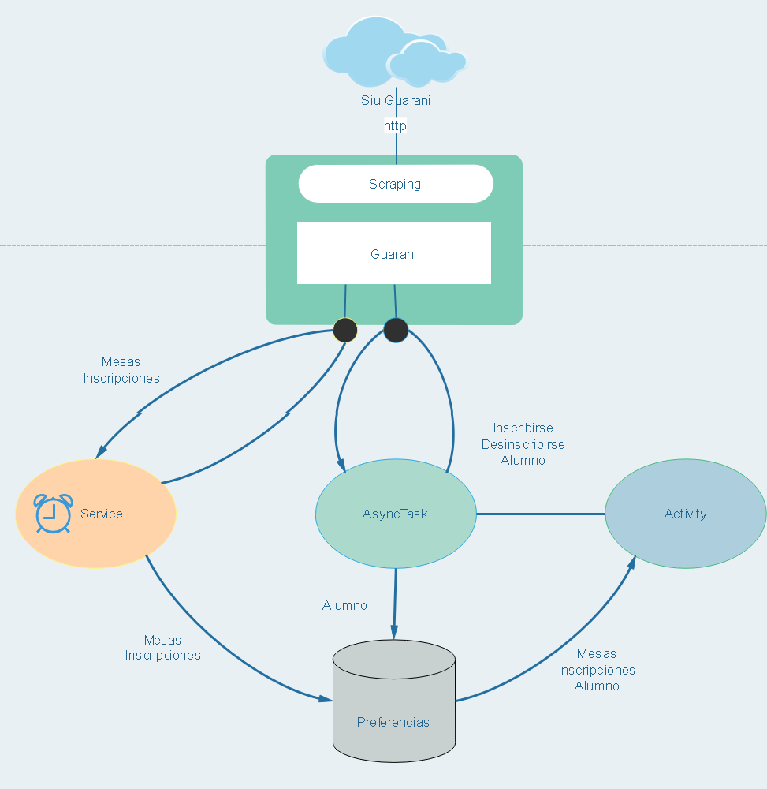
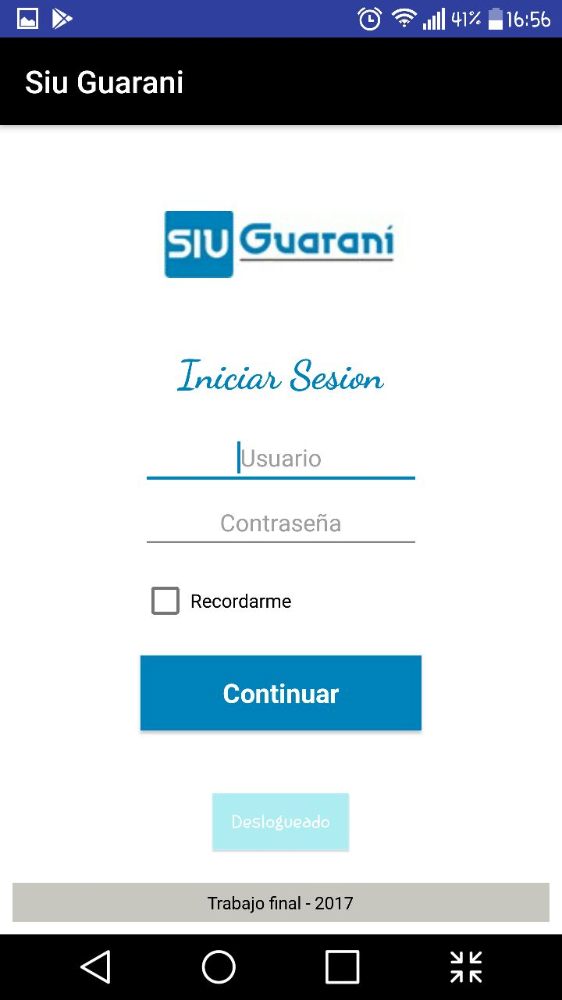
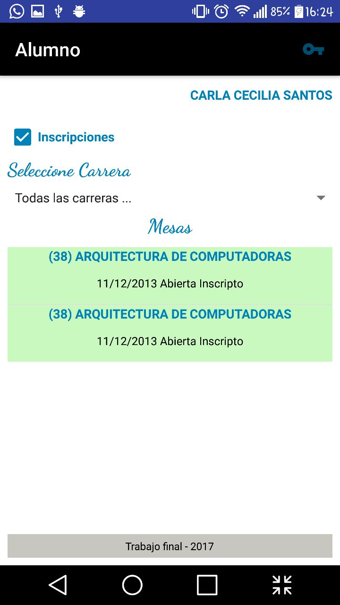

# Trabajo Final Taller de Nuevas Tecnologias 2017 #

Aplicacion movil desarrollada con Android para realizar Scraping sobre [siu-guarani][guarani-path]. Ver [tablero][tablero-path] en Trello

[guarani-path]: http://www.dit.ing.unp.edu.ar/v2070/www/

[tablero-path]:https://trello.com/b/b76gl2IC/scraping-guarani

Alumnos
  - Calfuquir, Jorge Nicolas
  - Parra, Iván Javier
  - Santos, Carla

## Especificacion ##
  - Permita establecer preferencias de app. (usuario y contraseña guaraní).
  - Muestre notificaciones de mesas disponibles.
  - Diariamente, sin la intervención del usuario, se verifique si hay o no mesa disponible.
  - Listado de materias disponibles cuando hay mesa (para el usuario de la conf).
  - Que permita inscribirse (pueden simular un servicio local que reciba el post).
  - Sino hay mesa, mostrar que no hay mesa disponible aún.

## Arquitectura ##

## Capturas ##

